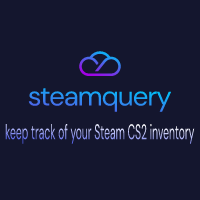

<p align="center">
  
</p>

### steamquery by devusSs 🚀

steamquery is a CLI tool that allows users to keep track of their [Counter-Strike 2](https://www.counter-strike.net/) inventory via automation and [Google sheets](https://docs.google.com/) by only applying a basic configuration.

It originally was called [steamquery-v2](https://github.com/devusSs/steamquery-v2) and was quite a clumsy project since code and features were added on the fly and without any intention of clean code or similar ideas. This projects aims to improve said problems.

### Why would I use this?

- quick runtimes (on a decent connection around 15 secs for an entire run)
- does not only track your inventory but also custom items if you'd like to (see below for more information)
- no installation or build needed, just download an already compiled release
- unlike some websites you do not need to login via Steam

### Why does the tool need my Steam API key?

The tool makes a request to the Steam API to check whether the session logons and the steam community are available for [Counter-Strike 2](https://www.counter-strike.net/). That's the only reason the program needs your API key.

### Usage

Download an already compiled [release](https://github.com/devusSs/steamquery/latest) and store it somewhere on your system.

You will then need to create a [Google service account](https://cloud.google.com/iam/docs/service-account-overview) for the [Google Sheets API](https://developers.google.com/sheets/api/guides/concepts) and store in a directory you would like to use.

You will also need to setup a config file:

```json
{
  "steam_user_id_64": 0,
  "steam_api_key": "your_steam_api_key",
  "spreadsheet_id": "spreadsheet_id_not_name_or_table"
}
```

You can call the config files whatever you would like to but will then need to specify them using the `-g` flag for the Google Cloud file and the `-c` for the config file.

If you would like to know more about flags run `steamquery --help`.

### Custom Configuration

As mentioned earlier you can specify additional items which might not be in your inventory or in storage units which cannot be fetched via the API or a website.

To do that simply add a items file and specify it using the `-i` flag when running steamquery. The file should be of following structure:

```json
{
    "items": [
       {
        "market_hash_name": "",
        "amount": 0
       }
    ]
}
```

You may also specify custom filters for your inventory items, like so:

```json
{
    "tradable": false,
    "marketable": true
}
```

More (potential) filters may be added soon.

### Debugging

In case you encounter any issues you can try running the program with either `--console` flag to print the log output to your terminal or go even further and specify the `--debug` flag which will add more verbose logs and also log to terminal.

Please use Google first to try solve your problem. Else [open an issue](https://github.com/devusSs/steamquery/issues).

### Building the app yourself

Check the [build documentation in the docs directory](./docs/build.md) for further information. Building yourself is not recommended since you need a few tools. If you do however want to build the app yourself please read the documentation.

## Disclaimer

This program is in no way affiliated with [Valve](https://www.valvesoftware.com/), [Steam](https://store.steampowered.com/) or [csgobackpack](https://csgobackpack.net/index.php). It simply uses these awesome platforms to enable users to save their time in keeping track of their inventory value.

Please refrain from using this program for potentailly disallowed actions according to the [Steam TOS](https://store.steampowered.com/eula/471710_eula_0) or if you do not know what it does or how to use it.

Any copyright goes to their respective owners. Please also check out the [go mod file](./go.mod) and the [go sum file](./go.sum) files to check out the awesome packages I used to build this project.

## Further features and updates

Check the [roadmap in the docs directory](./docs/roadmap.md) for more information.

## License

Licensed under [MIT License](./LICENSE)