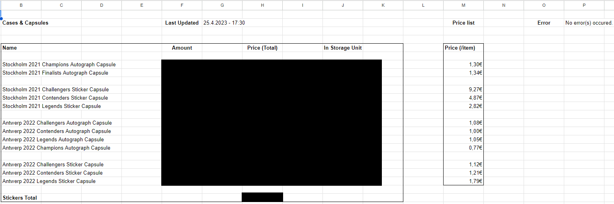
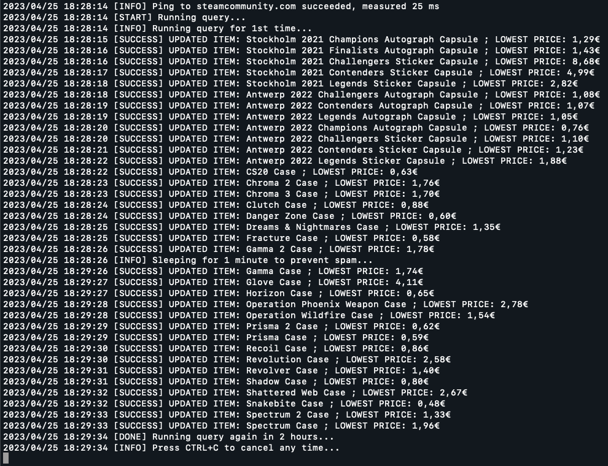

# SteamQuery by devusSs

## Disclaimer

DO NOT (!) USE THIS PROGRAM WITHOUT KNOWING WHAT IT DOES OR GETTING LECTURED BY THE CREATOR (devusSs).

This program is not affiliated with any services mentioned inside or outside of it.

This program may also not be safe for production use. It should be seen as a fun / site project by the developer.

Please contact the owner (devusSs) at devuscs@gmail.com to resolve any issues (especially trademarks and copyright stuff).

## Setup

Create a new raw [Google Sheet](https://docs.google.com/) and set it up like so (must not exactly match):

`Make sure there is a cell for last updated and errors each.`

The price /item column will be updated for each item specified in your config file (check below).

To calculate total values you would want to use Google's own sheet functions like:

```sh
= PRODUCT(CELL1 * CELL2)
```

or

```sh
= SUM(CELL1 + CELL2)
```

<br/>

Go to [Google Cloud](https://cloud.google.com/), set up a new project and enable the Google Drive API and the Google Sheets API. Then add a service account and generate keys in json format. Place that json file in a directory of your choice. Using the [files](files/) directory in the projects directory is recommended however while naming the json file `gcloud.json`.
If you need help doing that please refrain from sending me an E-Mail or opening an issue. There probably are good tutorials on Google or on Stackoverflow for that topic.

<br/>

Go to your [Steam dev settings](https://steamcommunity.com/dev/apikey) and generate an API key. It will be needed to query the status of the Steam API / Sessions Managers / Community Status of CSGO.

<br/>

Then create a `config.json` file a directory of your choice. Using the [files](files/) directory in the projects directory is recommended however while naming the config `config.json`.
<br/>
Use the [example config file](files/config.example.json) to create your own `config.json` file:

```json
{
  "item_list": [
    { "item_name (like on steam market)": "table_cell_on_google_sheet" },
    { "item_name (like on steam market)": "table_cell_on_google_sheet" },
    { "...": "..." }
  ],
  "last_updated_cell": "table_cell_to_show_last_update_on_google_sheet",
  "error_cell": "table_cell_to_show_potential_errors_on_google_sheet",
  "spreadsheet_id": "id_of_your_google_sheet_(get_from_link)",
  "update_interval": 2,
  "steam_api_key": "steam_api_key"
}
```

<br/>

`Out of experience: make sure to use an integer value for the update interval (remove the quotes)`

## Building and running the app

Either download an already compiled program from the [releases](https://github.com/devusSs/steamquery/releases) section or clone the repository and run either

```sh
make build
```

or

```sh
make pub
```

depending on your use case.

You can then run the app with either default flags or use the defined flags `-c` and `-g` to set your config file path and your gcloud.json file path respectively.

Successful output should look like this:


Errors will usually be self-explanatory. Any weird errors may require the use of [Google](https://google.com) or [creating an issue](https://github.com/devusSs/steamquery/issues) on Github.

## Further features (soonTM)

- automatically query items from Steam inventories
- automatically query items from Google sheets to make use of config easier
